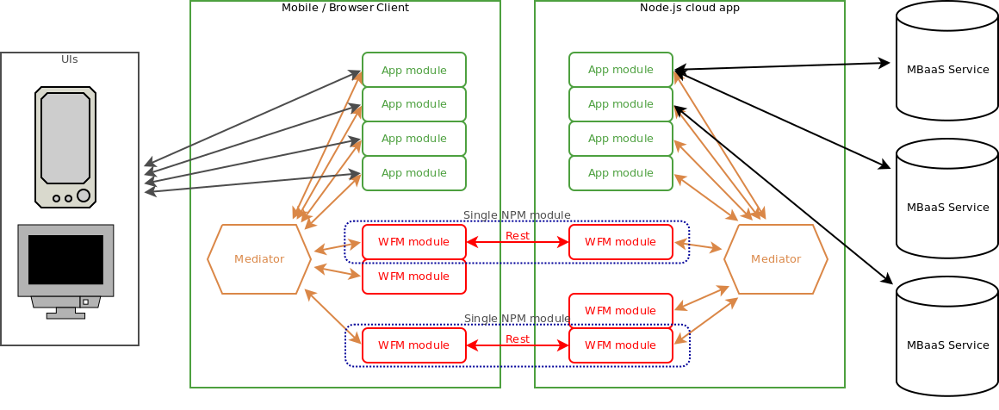
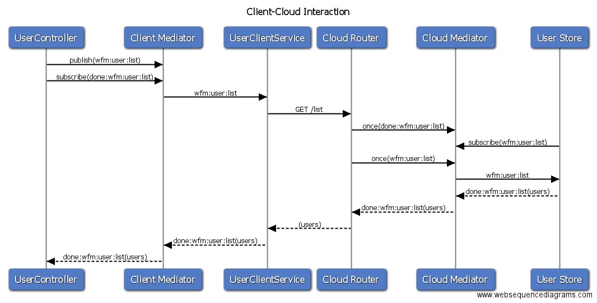

# Mediator topics over HTTP
## Automatic mirrorring of topics over network transport

---

# Architecture



---

# Single interaction




---


# Current
## Client

*lib/angular/user/user-controller.js*

```javascript
$scope.addUser = function addUser() {
  mediator.publish('wfm:user:create', $scope.newUser);
};
mediator.subscribe('done:wfm:user:create', function() {
  mediator.publish('wfm:user:list');
});
```

----

# Current
## Client

*lib/angular/services/user-client-service.js*

```javascript
mediator.subscribe('wfm:user:create', function(userToCreate) {
  self.create(userToCreate, function(error, createdUser) {
    if (error) {
      mediator.publish('error:wfm:user:create', error);
    } else {
      mediator.publish('done:wfm:user:create', createdUser);
    }
  });
});
```

----

# Current
## Server

*lib/server/router.js*

```javascript
userRoute.post(function(req, res) {
  var userToCreate = req.body;
  // race condition!
  mediator.once('done:wfm:user:create', function(createdUser) {
    res.json(createdUser);
  });

  // might get errors for later calls!
  mediator.once('error:wfm:user:create', function(error) {
    res.status(500).end(error);
  });
  mediator.publish('wfm:user:create', userToCreate);
});
```

----

# Current
## Server

*lib/server/userStore.js*

```javascript
mediator.subscribe('wfm:user:create', function(userToCreate) {
  store.create(userToCreate, function(err, u) {
    if (err) {
      mediator.publish('error:wfm:user:create', err);
    } else {
      mediator.publish('done:wfm:user:create', u);
    }
  });
});
```

---

# New
## Client

```javascript
mediator.mirror('wfm:user:create', {
  uri: config.apiHost + '/topics'
});
$scope.addUser = function addUser() {
  mediator.publish('wfm:user:create', $scope.newUser);
};
mediator.subscribe('done:wfm:user:create', function() {
  mediator.publish('wfm:user:list');
});
```

----

# New
## Server

```javascript
app.use('topics', mediator.mirrorMiddleware);
mediator.subscribe('wfm:user:create', function(userToCreate) {
  // callbackForTopic deals with publishing
  // to done: and error: topics
  store.create(user,
    mediator.callbackForTopic('wfm:user:create'));
});

mediator.publish('wfm:user:create', $scope.newUser);
```

---

# .mirror()

- Can deal with publishing to `done:` and `error:` topics convention
- Can create uuids to isolate requests/clients
- Can use a global config overridable per topic

---

# API draft

```javascript
mediator.mirror('wfm:user:create', {
  uri: "https://server.com/users/create",
  method: "POST"
});
```

----

# Globally configurable

```javascript
mediator.config({
  mirror: {
    url: "https://server.com/topics/"
  }
});
```

----

## Protocol support

```javascript
mediator.mirror('wfm:user:create', {
  uri: "amqp://server.com/"
  queue: 'create',
  exchange: 'user'
});
```

---

# Payload

## JSON
```javascript
{
  data: {
    username: 'bob',
    email: 'testing-admin@feedhenry.com'
  },
  mediator: {
    topic: 'wfm:user:create',
    reqid: '{uuid}'
  }
}
```

----

## Out-of-band

```
Headers:
X-MEDIATOR-TOPIC: 'wfm:user:create'
X-MEDIATOR-TOPIC-ID: '{uuid}'
```

```javascript
{
  username: 'bob',
  email: 'testing-admin@feedhenry.com'
}
```